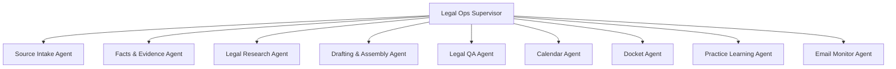

# California Litigation Legal Team

> Reusable Paperclip `agentcompanies/v1` package for California litigation workflows with supervised issue scope, approvals, and specialist agents — source-bound, matter-scoped, and confidentiality-first.

It packages one board-facing Legal Ops Supervisor, reusable specialist agents, a read-only Email Monitor Agent, one opt-in Practice Learning Agent, onboarding tasks, and reusable legal skills for intake, OCR, research, drafting, docket checks, calendaring, QA, workflow learning, and subpoena motion-to-compel work. Paperclip owns coordination (issues, assignment, heartbeats, approvals, audit trail); the legal skills own domain workflow discipline.

## Overview

| Field | Value |
| --- | --- |
| Tags | — |
| Tone | `green` |
| Agents | 10 |
| Projects | 1 (Firm Onboarding) |
| Tasks | 15 (onboarding and paused monitor routines) |
| Goals | 4 |
| Skills | 9 |

## How the firm operates

Hub-and-spoke around a single front door. The **Legal Ops Supervisor** runs onboarding, creates one **Matter Authorization Package** on each parent matter, and delegates focused child work orders that inherit it. Within that authorization, specialists may use configured read-only tools, conduct routine legal research, add verified authorities, process PDF/OCR, revise working copies, run QA, and coordinate internally without repeated approvals.

The supervising attorney decides only external acts, payment or budget expansion, protected-file mutation, matter/source expansion or cross-matter use, and material legal strategy. Login, MFA, CAPTCHA, and tool failures go to Legal Ops or the tool owner as operational interruptions.

Identity and constraints live in [COMPANY.md](COMPANY.md); operating governance in [OPERATIONS.md](OPERATIONS.md); the deliverable ledger in [PROJECT-INVENTORY.md](PROJECT-INVENTORY.md).

Default intake is **Light Intake Mode**. Legal Ops starts from the lawyer's description, prepares the Matter Authorization Package from plain-language answers, and asks only for the next material decision needed. The parent authorization persists for descendants until revoked, changed, or exhausted.

Active parent matter issues should carry a **Matter Dashboard** using `references/matter-status-digest.md`. This is the lawyer-facing control page that explains what the matter is, what workstreams are covered, what is waiting, who owns the next step, whether the lawyer needs to act, and where the latest artifacts live. Technical blocker chains stay available for audit, but they should not be the first thing a lawyer has to decode.

Matter context is reusable but relevance-based. Legal Ops should create or confirm a Matter Home at `{workspace}/Matters/{matter-short-name}/` when a matter/output root is approved, with issue audit output under `_paperclip_issues/{issue-identifier}/`. Specialists should check only the context artifacts relevant to their role and assignment. See `references/matter-context-artifacts.md` for the folder convention, tiered checking rule, and role defaults.

The template is also efficiency-first. Legal Ops uses one Matter Dashboard, one Matter Plan, and a compact work packet before opening child issues. Small triage, dedupe, Dashboard edits, and short status answers stay on the parent issue; active child issues are reserved for specialist-owned durable deliverables, longer tool runs, parallel lanes, material blockers, and review work.

## Org chart



## Agents

Each agent is defined by four files: `AGENTS.md` (role, triggers, handoffs, deliverables, decision rights, escalation), `SOUL.md` (identity and operating instincts), `HEARTBEAT.md` (runtime journal), and `TOOLS.md` (Paperclip API, file system, domain tools).

| Agent | Title | Reports to | Key skills |
| --- | --- | --- | --- |
| [Legal Ops Supervisor](agents/legal-ops-supervisor/AGENTS.md) | Reusable Litigation Workflow Supervisor | — | all workflows (front door) |
| [Source Intake Agent](agents/source-intake-agent/AGENTS.md) | Source Intake, Pleading Review, and OCR Specialist | legal-ops-supervisor | ca-pleading-intake-review, legal-pdf-processing |
| [Facts & Evidence Agent](agents/facts-evidence-agent/AGENTS.md) | Facts, Evidence, Exhibits, and Citation Table Specialist | legal-ops-supervisor | ca-litigation-drafting-workflow |
| [Legal Research Agent](agents/legal-research-agent/AGENTS.md) | Lexis Research and Citation Verification Specialist | legal-ops-supervisor | lexis-browseros-legal-research |
| [Drafting & Assembly Agent](agents/drafting-assembly-agent/AGENTS.md) | California Litigation Drafting and Working-Copy Assembly Specialist | legal-ops-supervisor | ca-litigation-drafting-workflow, ca-motion-drafting-workflow |
| [Legal QA Agent](agents/legal-qa-agent/AGENTS.md) | Confidentiality and Source Discipline Reviewer | legal-ops-supervisor | ca-litigation-drafting-workflow, lexis-browseros-legal-research |
| [Calendar Agent](agents/calendar-agent/AGENTS.md) | Litigation Calendar Proposal Specialist | legal-ops-supervisor | legal-calendaring-workflow |
| [Docket Agent](agents/docket-agent/AGENTS.md) | Public Docket Check Specialist | legal-ops-supervisor | lasc-browseros-docket-check |
| [Practice Learning Agent](agents/practice-learning-agent/AGENTS.md) | Private Workflow Learning Specialist | legal-ops-supervisor | practice-workflow-learning |
| [Email Monitor Agent](agents/email-monitor-agent/AGENTS.md) | Read-Only Legal Intake Monitor | legal-ops-supervisor | — (read-only routing) |

## Goals

- [Complete firm onboarding and runtime readiness](goals/complete-firm-onboarding-and-runtime-readiness/GOAL.md)
- [Run matter-scoped litigation work safely](goals/run-matter-scoped-litigation-work-safely/GOAL.md)
- [Produce source-bound litigation work product](goals/produce-source-bound-litigation-work-product/GOAL.md)
- [Improve firm workflow through opt-in learning](goals/improve-firm-workflow-through-opt-in-learning/GOAL.md)

## Projects

- [Firm Onboarding](projects/firm-onboarding/PROJECT.md) — import-time onboarding to configure workspace, runtime, local tools, connectors, Email/Calendar/Docket monitor profiles, SOPs, matter mapping, and policy before any live matter work. Twelve setup tasks are owned by the Legal Ops Supervisor, and three paused recurring monitor tasks are imported for Email, Calendar, and Docket monitoring.

Matter launch intake is a standalone skill-triggered front door owned by Legal Ops. Motion drafting is a separate downstream workflow, and subpoena MTC is one motion profile rather than a separate intake system or sub-organization. Live work begins from a user-created parent issue with a Matter Authorization Package; child issues reference it rather than copying it.

## Skills

`legal-calendaring-workflow` · `lexis-browseros-legal-research` · `ca-litigation-drafting-workflow` · `ca-pleading-intake-review` · `legal-matter-intake` · `legal-pdf-processing` · `lasc-browseros-docket-check` · `ca-motion-drafting-workflow` · `practice-workflow-learning`

## Import

From a running Paperclip instance:

```powershell
npx.cmd paperclipai company import https://github.com/mengbingrock/attymate/tree/master/companies/california-litigation-legal-team --target new --new-company-name "California Litigation Legal Team" --include company,goals,agents,projects,tasks,skills --yes --api-base http://127.0.0.1:3100
```

For local development from a checked-out repository:

```powershell
npx.cmd paperclipai company import .\companies\california-litigation-legal-team --target new --new-company-name "California Litigation Legal Team" --include company,goals,agents,projects,tasks,skills --yes --api-base http://127.0.0.1:3100
```

To import the company without onboarding starter issues, omit `tasks` from `--include`.

## Onboarding Troubleshooting

Use `references/onboarding-unblock-runbook.md` when onboarding is blocked by workspace selection, runner policy, or Paperclip status-update tooling. The active AttyMate WORKSPACE selection is the deployment source of truth; deployment-specific paths belong in the private Firm Operations Guide and must not be committed to this reusable package.

If an onboarding task is substantively complete but the issue cannot be marked done, record the terminal disposition and route the technical blocker to the Paperclip/AttyMate product owner instead of rerunning the same setup task.

## Post-Import Setup

- Complete the imported Firm Onboarding issues before live matter work.
- Configure each `codex_local` agent with the deployment's absolute `cwd` / workspace root.
- Configure authenticated Codex CLI access or an approved deployment-specific API-key auth mechanism.
- Configure a local PDF/OCR toolchain appropriate to the deployment, and approved output roots. Use `skills/legal-pdf-processing/scripts/pdf_runtime_probe.sh` to discover capabilities; no single PDF vendor is required.
- Review executable-script trust before using repo helper scripts. The PDF skill includes an optional local OCR helper at `skills/legal-pdf-processing/scripts/ocr_pdf_intake.ps1`; it requires explicit `{matter_root}` / `{output_root}` scope, writes only under the approved output root, and must be run only in a deployment-approved Python/OCR environment. Paperclip company import stores the markdown skill/reference files; deployments that want the helper should review or run it from the repository source after approval.
- Set budgets, model choices, and approval policies appropriate for the deployment.
- Use the canonical authorization matrix in `skills/legal-matter-intake/references/human-approval-gates.md`. Routine research, permitted downloads, configured read-only connectors, working-copy edits, QA, and internal coordination proceed within the parent authorization.
- Configure external-tool access before use: BrowserOS or equivalent browser tooling, email provider, calendar provider, Google Drive, Lexis, LASC, external knowledge-base/upload systems, filing, service, and upload/download workflows.
- Configure `email_monitor_profile`, `calendar_monitor_profile`, `docket_monitor_profile`, and `monitoring_report_policy` before enabling monitor routines.
- Keep monitor routines paused until the board/operator approves the profile and schedule. Within an enabled profile, monitors may read full in-scope content needed for review. No-change and duplicate-only runs end with a one-line routine result and create no lawyer-visible report, comment, triage issue, or Dashboard update. Material findings are deduplicated into one matter-level `monitor-report` and routed to Legal Ops.
- Use `references/matter-planning-playbook.md` when a new event arrives. Legal Ops should match or create the matter parent, classify all plausible workstreams, create child issues for safe work now, and record strategy/source/approval blockers in one batched plan.
- Use `agents/legal-ops-supervisor/references/workflow-efficiency-budget.md` to keep matter work compact: default to 3-5 active lanes, batch monitor candidates, and avoid child issues for coordination-only work.
- Use `references/matter-context-artifacts.md` to create or maintain matter context. Agents should check the matter context index plus role-relevant artifacts, not the entire context folder by default.
- Use `agents/legal-ops-supervisor/references/lawyer-facing-output-standard.md`: substantive analysis lives once in the controlling artifact, while technical scope and process details remain in the internal audit record unless they affect reliability or the lawyer's next action.
- Keep the completed Firm Operations Guide private to the deployment.
- Start live work only from a parent issue assigned to Legal Ops Supervisor.
- Keep the parent issue's Matter Dashboard current whenever child issues are created, blockers change, or the lawyer asks for status. Before a parent matter becomes `done`, `in_review`, or `blocked`, Legal Ops should clear stale blockers, list open decisions, and confirm no child issue is orphaned.
- Let Legal Ops translate lawyer-facing intake answers into the parent Matter Authorization Package. Child issues contain only the objective, relevant sources, output, and exceptions from parent authority.

Lawyer-facing communication follows `agents/legal-ops-supervisor/references/lawyer-facing-output-standard.md`: substantive analysis appears once in a controlling artifact, comments stay near 120 words, run results stay within two lines, and the Matter Dashboard changes only when posture, risk, deadline, decision, or deliverable status materially changes.

## Confidentiality And Portability

This package is intended for public reuse. Do not add client names, matter identifiers, case numbers, firm-specific procedures, private URLs, credentials, account IDs, knowledge-base IDs, calendar IDs, hardcoded local paths, or source matter files.

Deployment-specific behavior belongs in issue contracts, the private Firm Operations Guide, local adapter configuration, or private firm policy documents supplied at runtime. MTC remains a workflow owned by Legal Ops and the unified specialists, not an import-time project or separate sub-organization. Email monitoring is optional and read-only until configured. Practice learning is opt-in and private by default.

## References

- Agent Companies specification: https://agentcompanies.io/specification
- Paperclip: https://github.com/paperclipai/paperclip
