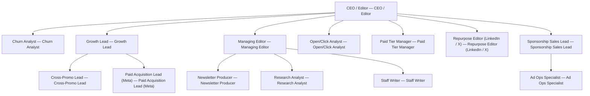

# NewsletterPress

> Operating company for a single paid newsletter — launch, grow, and monetize on Substack, beehiiv, or ConvertKit with a fixed cadence and the founder's voice as the moat.

## Overview

| Field | Value |
| --- | --- |
| Tags | — |
| Tone | `green` |
| Agents | 14 |
| Projects | 2 |
| Tasks | 6 |
| Goals | 3 |
| Skills | 11 |

## Org Chart

## Agents

- **[Ad Ops Specialist](agents/ad-ops-specialist/AGENTS.md)** — Ad Ops Specialist
- **[CEO / Editor](agents/ceo/AGENTS.md)** — CEO / Editor
- **[Churn Analyst](agents/churn-analyst/AGENTS.md)** — Churn Analyst
- **[Cross-Promo Lead](agents/cross-promo-lead/AGENTS.md)** — Cross-Promo Lead
- **[Growth Lead](agents/growth-lead/AGENTS.md)** — Growth Lead
- **[Managing Editor](agents/managing-editor/AGENTS.md)** — Managing Editor
- **[Newsletter Producer](agents/newsletter-producer/AGENTS.md)** — Newsletter Producer
- **[Open/Click Analyst](agents/open-click-analyst/AGENTS.md)** — Open/Click Analyst
- **[Paid Acquisition Lead (Meta)](agents/paid-acquisition-lead/AGENTS.md)** — Paid Acquisition Lead (Meta)
- **[Paid Tier Manager](agents/paid-tier-manager/AGENTS.md)** — Paid Tier Manager
- **[Repurpose Editor (LinkedIn / X)](agents/repurpose-editor/AGENTS.md)** — Repurpose Editor (LinkedIn / X)
- **[Research Analyst](agents/research-analyst/AGENTS.md)** — Research Analyst
- **[Sponsorship Sales Lead](agents/sponsorship-sales-lead/AGENTS.md)** — Sponsorship Sales Lead
- **[Staff Writer](agents/staff-writer/AGENTS.md)** — Staff Writer

## Goals

- **10,000 subscribers and $5,000 MRR (paid tier + sponsorships) within 90 days**: 
- **Free-to-paid conversion above 2.5%; Day-90 paid retention above 80%**: 
- **Weekly send shipped on cadence with the founder as the only author**: 

## Projects

- **[First 8 Issues — Cadence and Voice Capture](projects/first-8-issues-cadence-voice/PROJECT.md)**
- **[Paid Tier Launch and Sponsorship Rate Card](projects/paid-tier-and-rate-card-launch/PROJECT.md)**
